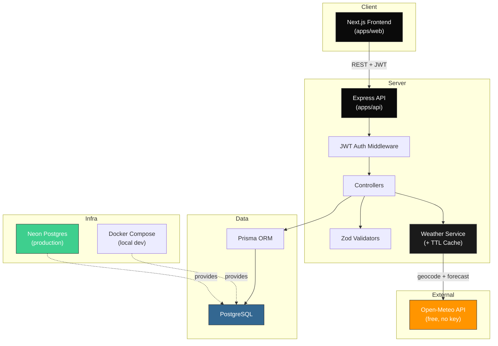

# Outfittr

> AI-powered travel wardrobe planner. Build outfits for every day of your trip based on weather, activities, and your personal style.

## Architecture



## Quick Start (5 minutes)

### Prerequisites

- Node.js ≥ 18
- Docker & Docker Compose (for local Postgres)
- npm ≥ 9

### 1. Clone & install

```bash
git clone <repo-url> outfittr && cd outfittr
npm install
```

### 2. Environment setup

```bash
cp apps/api/.env.example apps/api/.env
cp apps/web/.env.example apps/web/.env
```

### 3. Start database

```bash
docker-compose up -d
```

### 4. Run migrations & seed

```bash
cd apps/api
npx prisma migrate dev --name init
cd ../..
```

### 5. Start dev servers

```bash
# Terminal 1 — API (localhost:4000)
npm run dev --workspace=apps/api

# Terminal 2 — Web (localhost:3000)
npm run dev --workspace=apps/web
```

Open [http://localhost:3000](http://localhost:3000) — you're live.

---

## Project Structure

```
outfittr/
├── apps/
│   ├── api/          # Express + TypeScript API
│   │   ├── prisma/   # Schema & migrations
│   │   └── src/
│   │       ├── controllers/
│   │       ├── middleware/
│   │       ├── routes/
│   │       ├── validators/
│   │       └── lib/
│   └── web/          # Next.js + TypeScript frontend
│       └── src/
│           ├── app/        # App Router pages
│           ├── components/ # React components
│           └── lib/        # API client, hooks, utils
├── packages/
│   └── shared/       # Shared types between apps
├── docker-compose.yml
└── package.json      # Workspace root
```

## API Overview

Base URL: `http://localhost:4000/api`

### Auth

| Method | Endpoint         | Auth | Description            |
| ------ | ---------------- | ---- | ---------------------- |
| POST   | `/auth/register` | No   | Create account         |
| POST   | `/auth/login`    | No   | Sign in, returns JWT   |
| GET    | `/auth/me`       | Yes  | Get current user       |

### Wardrobe

| Method | Endpoint             | Auth | Description            |
| ------ | -------------------- | ---- | ---------------------- |
| GET    | `/wardrobe`          | Yes  | List all items         |
| POST   | `/wardrobe`          | Yes  | Create item            |
| PUT    | `/wardrobe/:id`      | Yes  | Update item            |
| DELETE | `/wardrobe/:id`      | Yes  | Delete item            |

### Trips

| Method | Endpoint                      | Auth | Description                          |
| ------ | ----------------------------- | ---- | ------------------------------------ |
| GET    | `/trips`                      | Yes  | List all trips                       |
| POST   | `/trips`                      | Yes  | Create trip (auto-fetches weather)   |
| GET    | `/trips/:id`                  | Yes  | Get trip detail with weather + days  |
| DELETE | `/trips/:id`                  | Yes  | Delete trip                          |
| POST   | `/trips/:id/refresh-weather`  | Yes  | Re-fetch weather for all trip days   |

### Weather Integration

Outfittr uses [Open-Meteo](https://open-meteo.com) for weather data — **free, no API key required** for non-commercial use.

How it works:

1. When a trip is created, the API geocodes the location string to lat/lon via Open-Meteo Geocoding.
2. It then fetches the daily forecast for the trip's date range (max/min temp, precipitation, WMO weather code).
3. Each `TripDay` row is updated with the weather snapshot.
4. The frontend renders weather cards with icons derived from WMO codes.
5. Users can re-fetch weather at any time via the "Refresh Weather" button, which calls `POST /trips/:id/refresh-weather`.

Both geocode and forecast responses are cached in-memory (geocode: 1 hour TTL, forecast: 15 min TTL) to avoid redundant API hits.

> **Note**: Open-Meteo forecasts are available for ~16 days into the future. Trips further out will have weather populated once they enter the forecast window.

## Deployment

### Web → Vercel

```bash
# In Vercel, set:
# - Root Directory: apps/web
# - Framework: Next.js
# - Environment Variables: NEXT_PUBLIC_API_URL
```

### API → Railway / Render / Fly.io

```bash
# Set environment variables:
# - DATABASE_URL (Neon connection string)
# - JWT_SECRET (random 64-char string)
# - CORS_ORIGIN (your Vercel domain)
# - NODE_ENV=production
```

### Database → Neon

1. Create a Neon project at [neon.tech](https://neon.tech)
2. Copy the connection string into `DATABASE_URL`
3. Run `npx prisma migrate deploy` from `apps/api/`

## Scripts

| Command | Description |
| ------- | ----------- |
| `npm run dev -w apps/api` | Start API dev server |
| `npm run dev -w apps/web` | Start Next.js dev server |
| `npm run build -w apps/api` | Build API |
| `npm run build -w apps/web` | Build frontend |
| `npm run lint -w apps/api` | Lint API |
| `npm run typecheck -w apps/api` | Type-check API |
| `npm run test -w apps/api` | Run API tests |

## License

MIT
